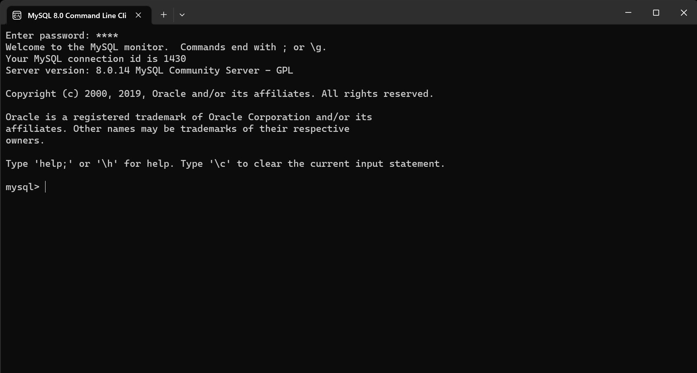
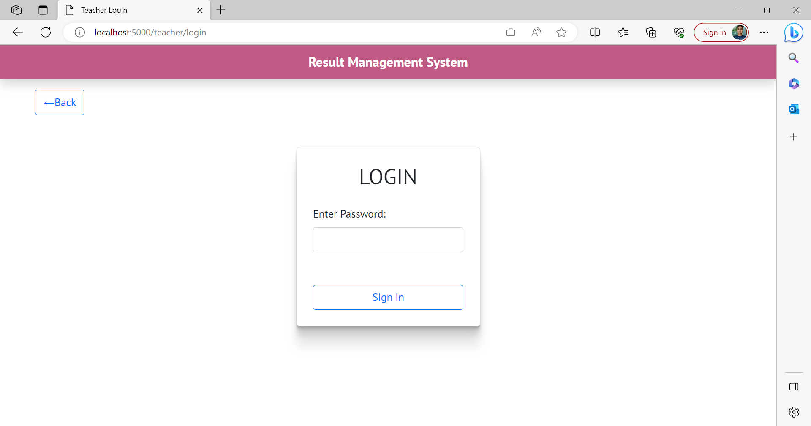

# Result-Management-Application

Develop a “Result Managment Application” using HTML, CSS, JavaScript and Node.

- Two types of users can login to application by clicking a button on homepage
- Students can enter their roll number and date of birth to view their result
- If roll number and D.O.B. does not match, an error should be shown on screen.
- Teachers can View all records, add new record, edit and delete the records.
   

# Setup Guide:-

##  Database Setup

**STEP1**:- Go to Start Menu and search for MySQL Command Line Client as show in the below database  

**STEP2**:- Open MySQL Command Line Client and enter your mysql password, (in my case it was “root”), as shown below.  

## OR
 ( if you are unable to access the database through above steps)
You can also access MySQL Command Line Client from Command Prompt. For this:

1.  Open Command Prompt.
2.  Navigate to the bin folder. For example:  `cd C:\Program Files\MySQL\MySQL Server  8.0\bin`
3.  Run the `mysql -u username -p`  command. For example: mysql -u root -p
5.  Enter the password.
  

**STEP3** :- Then create a database (in my case, I created database named resultdb, also you can name it whatever you want). For creating database use the following command:-
`create database database_name;`

For example:- create database resultdb;

**STEP4** :- Close MySQL Command Line Client.

**Note** : If you encounter any problem during database setup then please refer to this [**blog**](https://blog.devart.com/mysql-command-line-client.html)

If the above steps don't work then please create a database by some other means you are familiar with or use an existing database.    

## Backend

 **STEP1** :- Open the project in Visual Studio Code.

**STEP2** :- Go to toolbar --> View --> Terminal OR Simply press ctrl+`

**STEP3** :- Run command "npm install”.

**STEP4** :- Now go the config.env file and add your database name, username of the database and password of the database.( in my case, both username and password was root, Also please don’t use space in between when typing username, password and database)

For example:-  

 
STEP5 :- Now to run the project --> Run "npm start" on terminal.

**Note**: Please provide that database name in the config.env file which you have created or you can also provide any database name present in your system. 

## Frontend

Open URL **"https://localhost:5000"** on a browser.

## Note:-

The password to access the teacher page is --> **Teacher@1234**

## Screenshots:-

#### Home Page  

---

#### Teacher Login Page  

---

#### Teacher Home Page  

---

#### Add New Student Page  

---

#### Update Student Page  

---

#### Find Result Page  

---

#### Student Result Page  

---

#### 404 Page  
